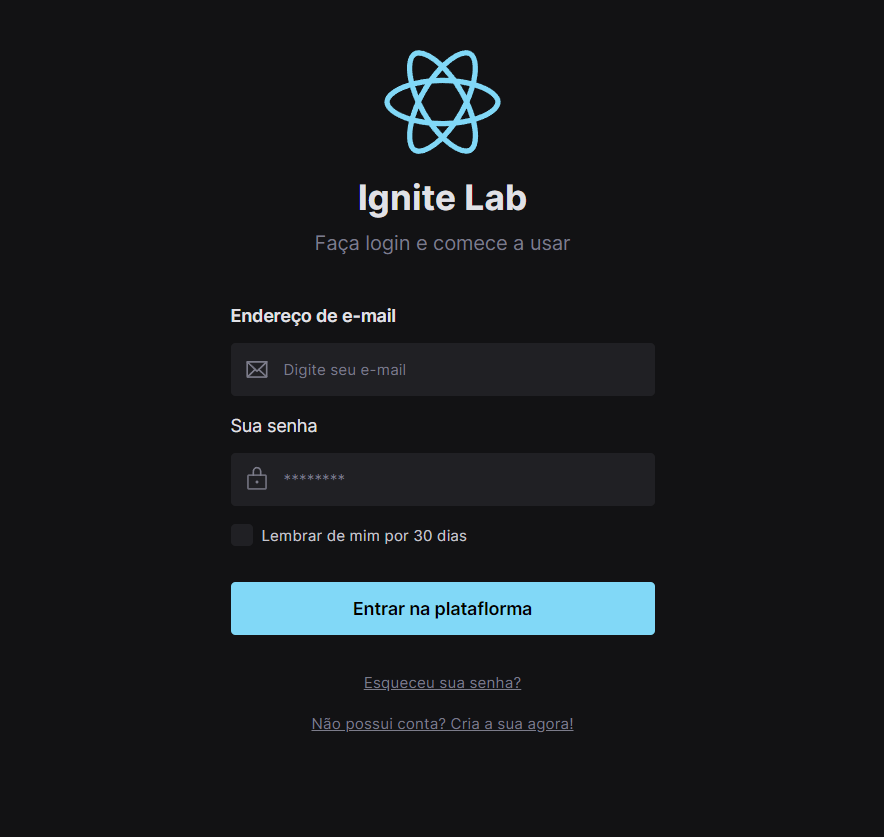

# Ignite Lab - do figma ao react

<a href="https://renatarko.github.io/lab_ignite/">Veja o projeto no Storybook</a>

Projeto desenvolvido durante as aulas do curso Ignite Lab da Rocketseat 🚀.

Algumas das tecnologias e features abordados para a aplicação:
- Figma
- React
- Tailwind CSS
- Storybook

